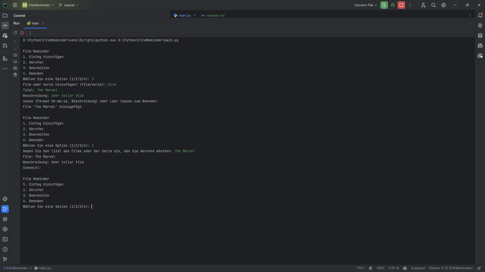
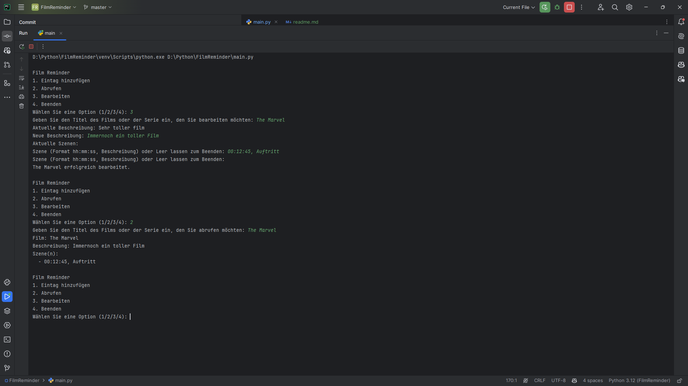
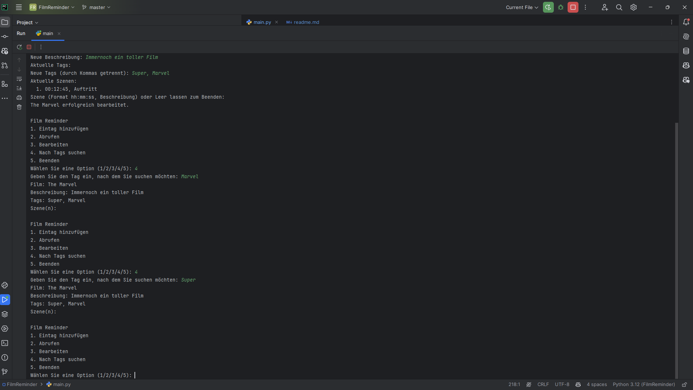

# Movie Reminder
## Description
This app helps you, that you don't forget your favorite moments in movies and in series.

## Usage
### Add a new Entry
1. Select add Entry
2. Selct the type of the entry (Movie or Series)
3. Enter the title of the movie or series
4. Enter the season and episode number (if it is a series)
5. Enter a short description of the Movie or Series
6. Optional: Enter a Szene
7. Optionally, add custom tags (e.g., genre, mood).

### Edit an Entry
1. Select Edit Entry.
2. Enter the title of the movie or series you want to edit.
3. Update the description, scenes, and tags as needed.

### Search by Tags
1. Select Search by Tags.
2. Enter a tag to find movies or series with that tag.
3. Review the results to see related entries.

## Installation
1. Clone the repository
2. run `python main.py`

## Preview
  
  
  